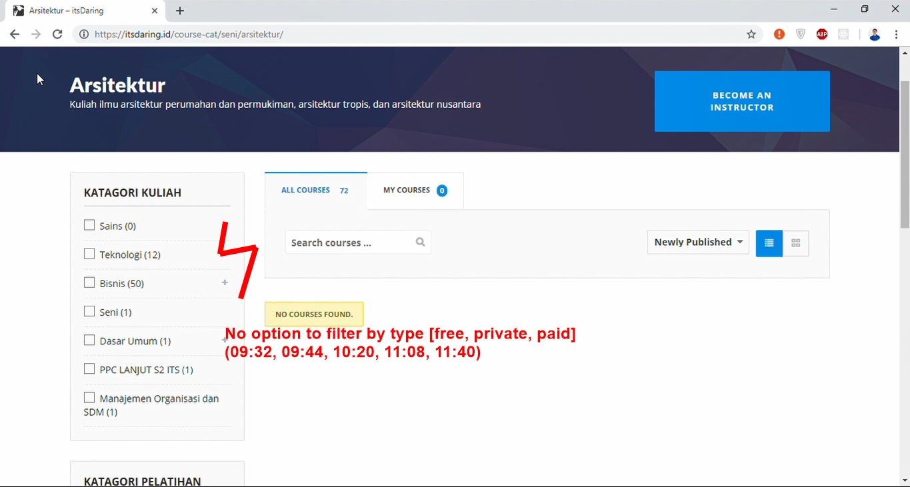

# Contextual Inquiry and Analysis
- [Contextual Inquiry and Analysis](#contextual-inquiry-and-analysis)
  - [Device/ App/ Website Description](#device-app-website-description)
  - [Instruction Script](#instruction-script)
  - [User Description](#user-description)
  - [Transcript](#transcript)
  - [Models and Annotations](#models-and-annotations)
    - [Artifact Model](#artifact-model)
    - [Flow Model](#flow-model)
    - [Cultural Model](#cultural-model)
  - [Do's and Don't's](#dos-and-donts)
    - [Do's](#dos)
    - [Dont's](#donts)
## Device/ App/ Website Description
[**itsdaring.id**](https://itsdaring.id/) is an online course platform made by PT ITS Tekno Sains to facilitate e-learning in various department. Using this website, lecturer and students can easily set up an online class, where they can share teaching matherials and giving assignment. The homepage look like the image below.

## Instruction Script
1. Open [**itsdaring.id**](https://itsdaring.id/) then create an account.
2. After creating account, try to sign in then sign out.
3. Try to find 1 course from Thechnology category especially about Informatics. Then read some of its learning materials.
4. Try to find 2 free course. Then, enroll to the courses. Then, read some its learning materials.
## User Description
- Architecture student
- 21 years old
- Female
- Familiar with e-learning concept.
- Have used other website for e-learning purpose
- Familiar with account creation process on website. Have made around 10 online accounts on various websites.
- Used to browse the internet and use laptop on daily basis
## Transcript
```
00:03 Me: Oke, jadi sekarang kamu coba cari website namanya itsDaring
00:09 User: its.. daring?
00:11 Me: Iya
00:17 User: Yang ini ya? Buka?
00:18 Me: Ya
00:24 User: Ya, terus?
00:25 Me: Terus, sekarang coba tolong buat akun di web ini
00:34 User:  Buat akun ya.... Hmm..
00:40 User: Hmm mana ya... Ini gimana caranya?
00:45 Me: Eee, coba cari aja
00:47 User: Aaaa.... Ya udah, lihat-lihat dulu
**melihat tampilan homepage dari atas ke bawah**
**ternyata, timer dari screen recorder yang digunakan berada tepat di atas navbar untuk tombol login (sign up)**
01:17 Me: Kalo ga, coba ini (overlay timer) digeser ke samping
01:21 User: Ya (menggeser overlay timer)
01:22 User: Aaa, (lalu klik tombol login). Ok, ok
01:30 User: Pantesan tadi kok ga kelihatan
**klik tombol sign up pada modal view login**
01:38 User: Ok, bikin?
01:39 Me: Ya
**mulai mengisikan data pada form sign up**
01:57 Me: Ohya, kalau ada hal-hal yang dibingungin, diungkapin ae
02:01 User: Heem, iya
02:23 User: Terus?
02:25 Me: Nah, kan tadi udah bikin akun. Sekarang coba login ke akunnya
**mencoba login**
**sempat lupa password**
03:07 Me: Kalo ga bisa, coba login e-mail di incognito. Tadi ada minta e-mail gitu kan?
03:22 User: Kayake aku lali passwordku deh
**mencoba sign up ulang**
03:48 User: Nah, bisa login. Sudah
03:50 Me: Oh udah login. Oke, sekarang coba logout terus login lagi.
04:00 User: **logout dari itsDaring**. Logout, terus login lagi
04:09 User: **login ke itsDaring**
04:21 User: Sudah
04:28 Me: Terus, sekarang coba buka 1 course atau materi yang masuk kategorinya itu Teknologi khususnya Informatika
**mencoba membuka-buka menu yang ada di navbar**
**membuka menu kuliah, memilih kategori teknologi**
**kesulitan menemukan Informatika**
04:58 User: Ini list coursenya ya? **padahal memilih Teknologi Informasi, bukan Informatika**
05:01 Me: Terus, buka aja sembarang 1 coursenya terus buka konten materinya. Coba-coba aja
**membuka konten materi course Rintisan Bisnis**
06:15 Me: Oke, terus ini yang terakhir untuk ini. Kalau tadi kan kita nyari course yang masuk Teknologi, khususnya Informatika. Nah sekarang cari 2 course yang sifatnya free.
06:29 User: Free?
06:30 Me: Lalu daftar ke course itu terus buka-buka kontennya juga kayak yang sekarang.
06:49 User: **mencoba membuka daftar course dari Arsitektut**
06:50 User: Ga onok. Wah, tidak ada. Ya udah balik dulu dah **menekan tombol back, kembali ke course rintisan bisnis**
07:10 User: **membuka course Fisika**
07:18 User: Emm, iki kalo no course found memang ga ada atau gimana?
07:23 Me: Berarti ga ada coursenya untuk kategori itu
07.35 User: **membuka homepage**
07:44 User: **mencoba membaca daftar course yang muncul di homepage**
07:51 User: Berarti iki (jurusan) ga semuanya ada yo?
07:54 Me: Iyo, cuma sebagian yang masuk
08:05 User: Apa tadi perintahe?
08:08 Me: Cari 2 course yang tulisannya free
08:20 User: Yang kayak gini ta? **menunjuk pada course Manajemen Keberlangsungan Bisnis yang bersifat private**
08:25 Me: Itu kan berarti private course bukan free course
08:42 User: **mencoba melihat daftar course kategori Agama**
08:46 User: **mencoba melihat daftar course Bahasa**
08:50 User: Lho ga ada juga
09:05 User: **membuka daftar course Teknik Komputer** Kiro-kiro opo sing onok?
09:08 Me: Mulai dari depan aja.
09:10 User: Whatt, yaaah
09:20 User: **membuka daftar course Informatika** Lho, berarti tadi aku buka Teknologi Informasi dong. Salah dong
09:25 Me: Iya, ini coursenya bebas pokok itu free course
09:29 User: Emm, oke deh
09:32 User: Free course, gimana cara nyari free course
09:44 User: Berusaha menemukan free course. **membuka course lain yang juga private**
10:00 Me: Ga ketemu ketemu ya?
10:05 User: Iyo, endi free course-e?
10:20 User: Saya belum menemukan
10:29 User: **mencoba menggunakan fitur search dengan keyword 'free course'** Coba yo
10:46 User: **Hasil search ternyata 0** Aku berasa kayak lagi ujian online
10:55 User: **kembali ke daftar course Teknologi Informasi**
11:00 Me: Kalau mau takkasih clue, buka dari halaman depan
11:08 User: **melihat-lihat homepage** Ya ya, di mana saya bisa menemukan free course
11:20 User: Sing onok iki ta? pengikut?
11:28 User: **membuka daftar course dari profil pribadi**
11:31 User: Haduh, ngelu aku Dan
11:36 Me: Semangat yo
11:40 User: Ga ada juga
11:45 Me: Itu kan masih yang private-private course
11: 54 User: Aaa, free. Akhirnya
12:03 Me: Nah, temukan 2 course yang free, terus daftar ke course-nya. Terus buka-buka kontennya juga.
12:08 User: Oke, take this course. **menekan tombol take this course**
12:11 User: **pindha ke course satunya** Take this course. **menekan tombol take this course**
12:15 User: Sudah dua
12:24 Me: Oke itu aja, sudah cukup
12:28 User: Yayy, hahaha
```

## Models and Annotations
### Artifact Model




### Flow Model

### Cultural Model

## Do's and Don't's
### Do's
- Add view all under course menu in navbar
- Add more filter option on courses listing
- Change font size in sign up form to the same for all field labels
- Add 'retype password' field in sign up form
- Change text in login button into 'Login / Sign up'
### Dont's
- Use lazy load to list all available courses on homepage which might be annoying